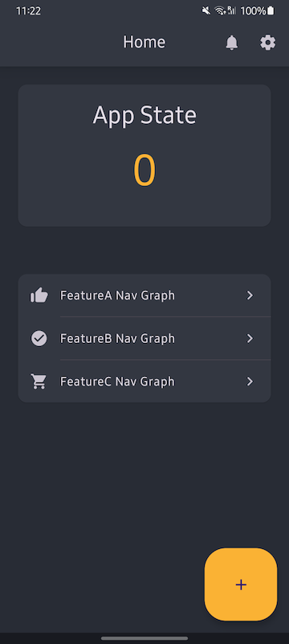

# Koin-NavGraph-Scope
Scope your dependencies using Koin + Compose Navigation for better memory and state management.

The project demonstrates how to use Koin to provide dependencies to composable destinations within a navigation graph. Each feature navigation graph can have its own Koin scope, allowing for proper dependency management and state isolation.

This project is required to enable K2 mode.

## Features

-   **Dependency Injection with Koin:** Utilizes Koin for managing dependencies throughout the application.
-   **Jetpack Compose Navigation:** Implements navigation between composable screens using Jetpack Compose Navigation.
-   **Navigation Scopes:** Demonstrates how to create and manage Koin scopes tied to feature navigation graphs.
-   **Saved State Handling:** Shows how to save and restore the state of Koin scopes across configuration changes and process death.
-   **Deep Linking:** Implements deep linking to specific composable destinations.
